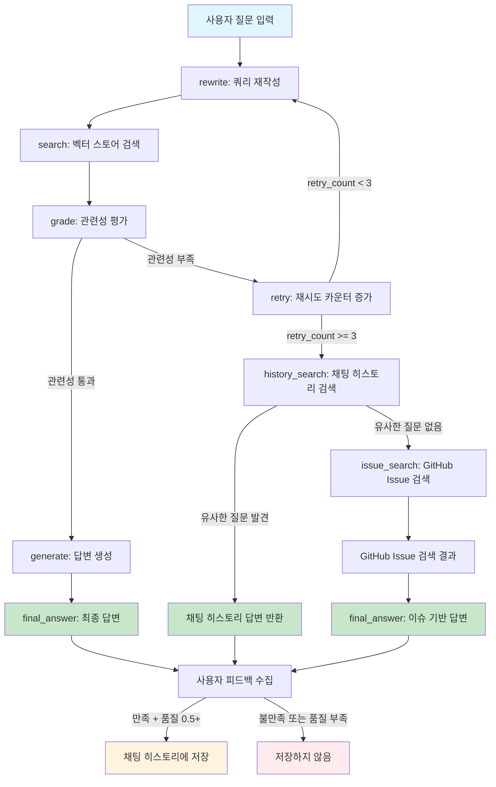
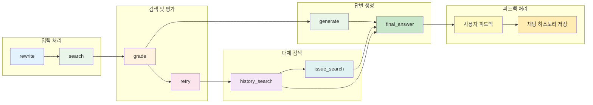
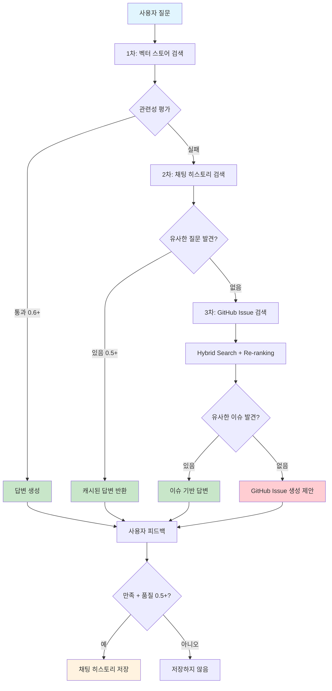

# AI Agent Chatbot v2.2

GitHub 문서를 기반으로 한 지능형 챗봇 시스템으로, Corrective RAG, LangGraph 워크플로우, Hybrid Search, Cross-Encoder Re-ranking을 활용하여 정확하고 관련성 높은 답변을 제공합니다.

## 🚀 주요 기능

### 1. **Corrective RAG (Corrective Retrieval-Augmented Generation)**
- **자동 재시도**: 관련성 부족 시 쿼리 재작성 및 재검색
- **다중 검색 소스**: 벡터 스토어 → 채팅 히스토리 → GitHub Issue 검색
- **관련성 평가**: 0.6 이상의 임계값으로 정확한 답변 보장
- **오타 보정**: 질문 rewrite 시 자동 오타 수정

### 2. **LangGraph 워크플로우**
- **상태 기반 관리**: 복잡한 AI 에이전트 로직을 그래프로 관리
- **조건부 분기**: 검색 결과에 따른 자동 경로 선택
- **에러 처리**: 통합된 에러 처리 및 복구 메커니즘

### 3. **Hybrid Search + Cross-Encoder Re-ranking**
- **BM25 스코어링**: 키워드 기반 정확한 매칭 (60% 가중치)
- **Dense Embedding**: OpenAI 임베딩을 사용한 의미적 유사도 (40% 가중치)
- **Cross-Encoder Re-ranking**: 최종 순위 결정으로 정확도 향상
- **GitHub Issue 검색**: 유사한 이슈 자동 검색 및 답변 제공

### 4. **사용자 피드백 시스템**
- **만족도 평가**: 👍 만족 / 👎 불만족 버튼
- **자동 저장**: 만족스러운 답변을 채팅 히스토리에 자동 저장
- **품질 기준**: 답변 품질 점수 0.5 이상일 때만 저장
- **재사용**: 향후 유사한 질문에 저장된 답변 재사용

### 5. **채팅 히스토리 관리**
- **유사도 검색**: 과거 대화에서 관련 질문 자동 검색
- **임계값 조정**: 유사도 0.5 이상에서 매칭 (기존 0.8에서 개선)
- **세션 관리**: 세션별 대화 기록 분리 및 관리
- **통계 제공**: 채팅 히스토리 통계 및 분석

### 6. **GitHub 통합**
- **자동 이슈 제안**: 답변 실패 시 GitHub Issue 생성 제안
- **이슈 검색**: 유사한 GitHub Issue 자동 검색
- **답변 추출**: Closed 이슈에서 해결 방법 추출
- **URL 생성**: 자동으로 GitHub Issue 생성 URL 제공

## 🏗️ 시스템 아키텍처


## 🔍 유사도 검색 시스템

### 1. **채팅 히스토리 유사도 검색**
```python
# 유사도 계산 방식
similarity_score = cosine_similarity(question_embedding, history_embedding)

# 임계값 설정
if similarity_score > 0.5:  # 0.8에서 0.5로 개선
    return cached_answer
```

### 2. **GitHub Issue Hybrid Search**
```python
# 1단계: BM25 스코어링
bm25_score = calculate_bm25(question, issue_text)

# 2단계: Dense Embedding
dense_score = cosine_similarity(question_embedding, issue_embedding)

# 3단계: Hybrid Score
hybrid_score = bm25_score * 0.6 + dense_score * 0.4

# 4단계: Cross-Encoder Re-ranking
final_score = hybrid_score * 0.7 + cross_encoder_score * 0.3
```

### 3. **답변 품질 평가**
```python
# 답변 품질 점수 계산
quality_score = evaluate_answer_quality(question, answer)

# 저장 조건
if quality_score >= 0.5 and user_feedback == 'satisfied':
    save_to_chat_history(answer)
```

## 💾 데이터 저장 및 관리

### 1. **채팅 히스토리 저장**
- **저장 조건**: 사용자 만족 + 품질 점수 0.5 이상
- **저장 위치**: ChromaDB 벡터 스토어
- **임베딩 모델**: text-embedding-3-large
- **검색 방식**: 코사인 유사도

### 2. **문서 벡터화**
- **청크 크기**: 1500자
- **오버랩**: 300자
- **임베딩 모델**: text-embedding-3-large
- **저장소**: ChromaDB (Repository별 분리)

### 3. **세션 관리**
- **세션 ID**: UUID 기반 고유 식별자
- **분리 저장**: 세션별 대화 기록 분리
- **통계 제공**: 세션별 채팅 수, 만족도 등

## 🛠️ 설치 및 실행

### 1. **환경 설정**
```bash
# 저장소 클론
git clone https://github.com/palendy/02_AI_Agent.git
cd 02_AI_Agent/02_chatbot_agent

# 가상환경 생성 및 활성화
python -m venv venv
source venv/bin/activate  # Linux/Mac
# venv\Scripts\activate  # Windows

# 의존성 설치
pip install -r requirements.txt
```

### 2. **환경 변수 설정**
```bash
# .env 파일 생성
OPENAI_API_KEY=your_openai_api_key
GITHUB_TOKEN=your_github_token
DEFAULT_MODEL_NAME=gpt-4o-mini
EMBEDDING_MODEL=text-embedding-3-large
RELEVANCE_THRESHOLD=0.6
GITHUB_REPOSITORIES=https://github.com/owner/repo1,https://github.com/owner/repo2
```

### 3. **실행**
```bash
# Streamlit 웹 인터페이스
streamlit run view/app.py

# CLI 인터페이스
python main.py
```

## 🔄 LangGraph 워크플로우 구조

### 전체 워크플로우 다이어그램



### LangGraph 노드 상세 구조



### 검색 우선순위 플로우



## 🔧 주요 설정

### 1. **검색 설정**
```python
# config.py
RELEVANCE_THRESHOLD = 0.6      # 관련성 임계값
MAX_RETRIES = 3                # 최대 재시도 횟수
MAX_SEARCH_RESULTS = 8         # 최대 검색 결과 수
CHUNK_SIZE = 1500              # 문서 청크 크기
CHUNK_OVERLAP = 300            # 청크 오버랩
```

### 2. **모델 설정**
```python
DEFAULT_MODEL_NAME = "gpt-4o-mini"           # 기본 LLM
EMBEDDING_MODEL = "text-embedding-3-large"   # 임베딩 모델
CROSS_ENCODER_MODEL = "cross-encoder/ms-marco-MiniLM-L-6-v2"  # Re-ranking
```

### 3. **GitHub 설정**
```python
GITHUB_REPOSITORIES = "repo1,repo2"  # 검색할 Repository 목록
GITHUB_TOKEN = "your_token"          # GitHub API 토큰
```

## 📈 사용 예시

### 1. **기본 질문**
```
사용자: "SRS Agent에서 module not found 에러가 발생해요"
시스템: 
1. 벡터 스토어에서 관련 문서 검색
2. 관련성 평가 (0.8 > 0.6 통과)
3. 답변 생성 및 제공
4. 사용자 피드백 수집
```

### 2. **유사한 질문 재사용**
```
사용자: "SRS Agent에서 module not foun 에러 뭐야"  # 오타 포함
시스템:
1. 벡터 스토어 검색 (관련성 부족)
2. 쿼리 재작성 ("module not found"로 수정)
3. 채팅 히스토리 검색 (유사도 0.7 > 0.5)
4. 이전 답변 재사용
```

### 3. **GitHub Issue 검색**
```
사용자: "설치 방법을 모르겠어요"
시스템:
1. 벡터 스토어 검색 (관련성 부족)
2. 채팅 히스토리 검색 (결과 없음)
3. GitHub Issue 검색 (Hybrid Search + Re-ranking)
4. 유사한 이슈 답변 제공
5. GitHub Issue 생성 제안
```

## 🎯 핵심 개선사항

### v2.2 (현재)
- ✅ Hybrid Search + Cross-Encoder Re-ranking
- ✅ 사용자 피드백 시스템
- ✅ 유사도 검색 임계값 최적화
- ✅ 오타 자동 보정
- ✅ 코드 정리 및 최적화

### v2.1
- ✅ GitHub Issue 제안 시스템
- ✅ 워크플로우 단순화
- ✅ 에러 노드 제거

### v2.0
- ✅ LangGraph 워크플로우 도입
- ✅ 다중 Repository 지원
- ✅ 채팅 히스토리 관리
- ✅ 관련성 임계값 조정

## 🤝 기여하기

1. Fork the repository
2. Create a feature branch
3. Commit your changes
4. Push to the branch
5. Create a Pull Request

## 📄 라이선스

이 프로젝트는 MIT 라이선스 하에 배포됩니다.

## 📞 지원

문제가 발생하거나 질문이 있으시면 GitHub Issues를 통해 문의해주세요.

---

**AI Agent Chatbot v2.2** - 더 정확하고 지능적인 답변을 위한 최신 RAG 기술의 집약체