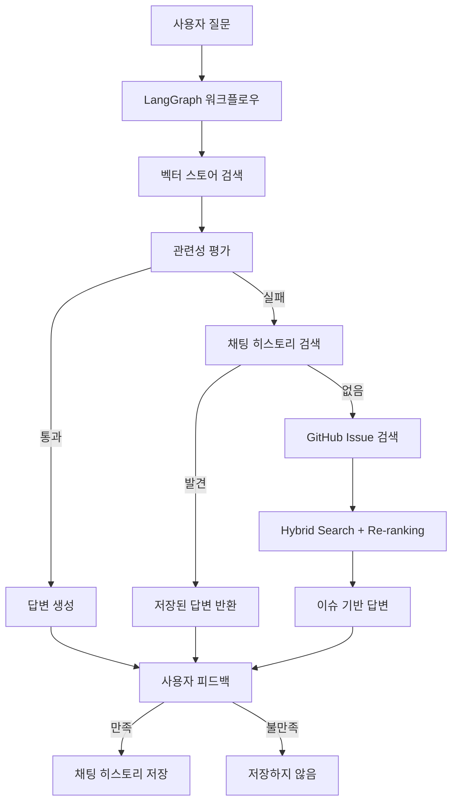
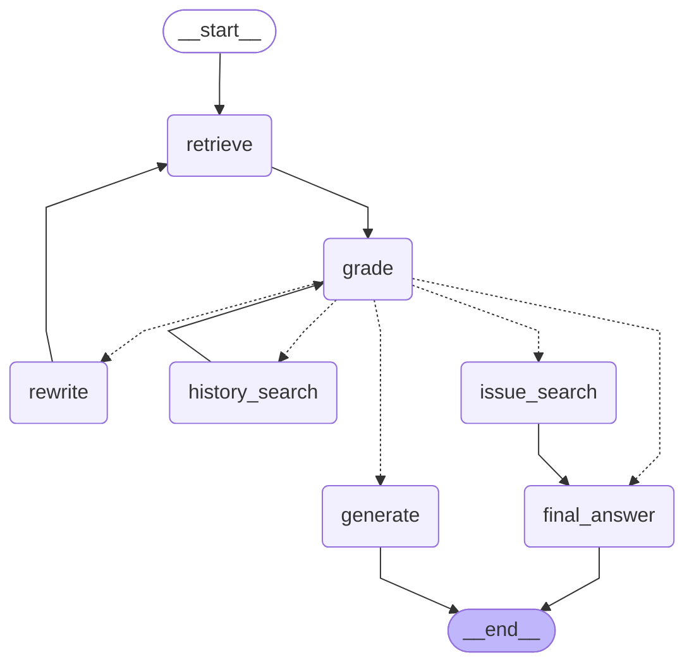
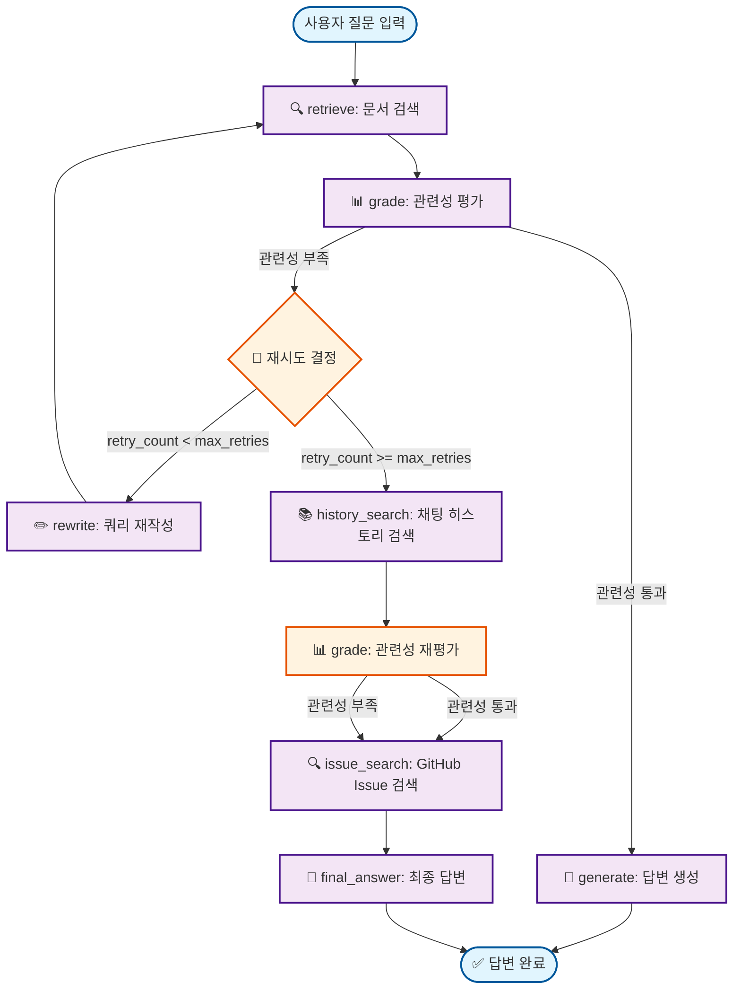

# AI Agent Chatbot v2.2

GitHub 문서를 기반으로 한 지능형 챗봇 시스템으로, Corrective RAG, LangGraph 워크플로우, Hybrid Search, Cross-Encoder Re-ranking을 활용하여 정확하고 관련성 높은 답변을 제공합니다.

## 🚀 주요 기능

### 1. **Corrective RAG (Corrective Retrieval-Augmented Generation)**
- **자동 재시도**: 관련성 부족 시 쿼리 재작성 및 재검색
- **다중 검색 소스**: 벡터 스토어 → 채팅 히스토리 → GitHub Issue 검색
- **관련성 평가**: 0.6 이상의 임계값으로 정확한 답변 보장
- **오타 보정**: 질문 rewrite 시 자동 오타 수정

### 2. **LangGraph 워크플로우**
- **상태 기반 관리**: 복잡한 AI 에이전트 로직을 그래프로 관리
- **조건부 분기**: 검색 결과에 따른 자동 경로 선택
- **에러 처리**: 통합된 에러 처리 및 복구 메커니즘

### 3. **Hybrid Search + Cross-Encoder Re-ranking**
- **BM25 스코어링**: 키워드 기반 정확한 매칭 (60% 가중치)
- **Dense Embedding**: OpenAI 임베딩을 사용한 의미적 유사도 (40% 가중치)
- **Cross-Encoder Re-ranking**: 최종 순위 결정으로 정확도 향상
- **GitHub Issue 검색**: 유사한 이슈 자동 검색 및 답변 제공

### 4. **사용자 피드백 시스템**
- **만족도 평가**: 👍 만족 / 👎 불만족 버튼
- **자동 저장**: 만족스러운 답변을 채팅 히스토리에 자동 저장
- **품질 기준**: 답변 품질 점수 0.5 이상일 때만 저장
- **재사용**: 향후 유사한 질문에 저장된 답변 재사용

### 5. **채팅 히스토리 관리**
- **유사도 검색**: 과거 대화에서 관련 질문 자동 검색
- **임계값 조정**: 유사도 0.5 이상에서 매칭
- **세션 관리**: 세션별 대화 기록 분리 및 관리
- **통계 제공**: 채팅 히스토리 통계 및 분석

### 6. **GitHub 통합**
- **자동 이슈 제안**: 답변 실패 시 GitHub Issue 생성 제안
- **이슈 검색**: 유사한 GitHub Issue 자동 검색
- **답변 추출**: Closed 이슈에서 해결 방법 추출
- **URL 생성**: 자동으로 GitHub Issue 생성 URL 제공

## 🏗️ 시스템 아키텍처



## 🔍 핵심 코드 구조

### 1. **LangGraph 워크플로우 노드**

```python
# model/langgraph_workflow.py
class CorrectiveRAGWorkflow:
    def __init__(self, vector_store, chat_history_manager, model_name):
        self.vector_store = vector_store
        self.chat_history_manager = chat_history_manager
        self.llm = ChatOpenAI(model=model_name, temperature=0.1)
        self._build_workflow()
    
    def _build_workflow(self):
        """워크플로우 그래프 구성"""
        workflow = StateGraph(CorrectiveRAGState)
        
        # 노드 추가
        workflow.add_node("retrieve", self._retrieve_node)
        workflow.add_node("grade", self._grade_node)
        workflow.add_node("generate", self._generate_node)
        workflow.add_node("rewrite", self._rewrite_node)
        workflow.add_node("history_search", self._history_search_node)
        workflow.add_node("issue_search", self._issue_search_node)
        workflow.add_node("final_answer", self._final_answer_node)
        
        # 엣지 추가
        workflow.add_edge("retrieve", "grade")
        workflow.add_conditional_edges("grade", self._should_continue)
        workflow.add_edge("rewrite", "retrieve")
        workflow.add_edge("generate", "final_answer")
        workflow.add_edge("history_search", "grade")
        workflow.add_edge("issue_search", "final_answer")
        
        self.workflow = workflow.compile()
```

### 2. **Hybrid Search 구현**

```python
# model/github_issue_helper.py
class GitHubIssueHelper:
    def search_similar_issues(self, question: str, max_results: int = 5) -> List[Dict[str, Any]]:
        """Hybrid Search + Cross-Encoder Re-ranking"""
        try:
            # 1. 후보 이슈 수집
            candidate_issues = self._get_candidate_issues(question)
            
            # 2. Hybrid Score 계산
            hybrid_scores = self._calculate_hybrid_scores(question, candidate_issues)
            
            # 3. Cross-Encoder Re-ranking
            reranked_issues = self._cross_encoder_rerank(question, hybrid_scores, max_results)
            
            return reranked_issues
        except Exception as e:
            logger.error(f"GitHub Issue 검색 실패: {e}")
            return []
    
    def _calculate_hybrid_scores(self, question: str, issues: List[Dict]) -> List[Dict]:
        """BM25 + Dense Embedding Hybrid Score"""
        question_embedding = self.embedding_model.embed_query(question)
        
        for issue in issues:
            # BM25 Score (60%)
            bm25_score = self._calculate_bm25_score(question, issue['text'])
            
            # Dense Score (40%)
            dense_score = self._calculate_dense_score(question_embedding, issue['embedding'])
            
            # Hybrid Score
            issue['hybrid_score'] = bm25_score * 0.6 + dense_score * 0.4
        
        return sorted(issues, key=lambda x: x['hybrid_score'], reverse=True)
```

### 3. **채팅 히스토리 관리**

```python
# model/chat_history.py
class ChatHistoryManager:
    def search_similar_questions(self, question: str, k: int = 5) -> List[Dict[str, Any]]:
        """유사한 질문 검색"""
        try:
            # 질문 임베딩
            question_embedding = self.embedding_model.embed_query(question)
            
            # 유사도 검색
            results = self.collection.query(
                query_embeddings=[question_embedding],
                n_results=k,
                include=['metadatas', 'documents', 'distances']
            )
            
            similar_questions = []
            for i, (metadata, document, distance) in enumerate(zip(
                results['metadatas'][0], 
                results['documents'][0], 
                results['distances'][0]
            )):
                similarity_score = 1 - distance
                if similarity_score >= 0.5:  # 임계값 0.5
                    similar_questions.append({
                        'question': metadata['question'],
                        'answer': document,
                        'similarity_score': similarity_score,
                        'session_id': metadata['session_id']
                    })
            
            return similar_questions
        except Exception as e:
            logger.error(f"채팅 히스토리 검색 실패: {e}")
            return []
```

### 4. **Streamlit 웹 인터페이스**

```python
# view/app.py
def render_chat_interface():
    """채팅 인터페이스 렌더링"""
    # 채팅 히스토리 표시
    for message in st.session_state.chat_history:
        with st.chat_message(message["role"]):
            st.markdown(message["content"])
    
    # 사용자 입력
    if prompt := st.chat_input("질문을 입력하세요..."):
        # 챗봇 응답 생성
        with st.spinner("답변을 생성하는 중..."):
            response = st.session_state.chatbot.generate_response(
                prompt, 
                st.session_state.current_session_id
            )
        
        # 응답 표시
        with st.chat_message("assistant"):
            st.markdown(response['answer'])
            
            # 피드백 버튼
            col1, col2 = st.columns(2)
            with col1:
                if st.button("👍 만족", key="satisfied"):
                    handle_feedback("satisfied", response)
            with col2:
                if st.button("👎 불만족", key="dissatisfied"):
                    handle_feedback("dissatisfied", response)
```

## 🛠️ 설치 및 실행

### 1. **환경 설정**
```bash
# 저장소 클론
git clone https://github.com/palendy/02_AI_Agent.git
cd 02_AI_Agent/02_chatbot_agent

# 가상환경 생성 및 활성화
python -m venv venv
source venv/bin/activate  # Linux/Mac
# venv\Scripts\activate  # Windows

# 의존성 설치
pip install -r requirements.txt
```

### 2. **환경 변수 설정**
```bash
# .env 파일 생성
OPENAI_API_KEY=your_openai_api_key
GITHUB_TOKEN=your_github_token
DEFAULT_MODEL_NAME=gpt-4o-mini
EMBEDDING_MODEL=text-embedding-3-large
RELEVANCE_THRESHOLD=0.6
GITHUB_REPOSITORIES=https://github.com/owner/repo1,https://github.com/owner/repo2
LOG_LEVEL=INFO

# ChromaDB 설정
CHROMA_MAX_SIZE=0
CHAT_HISTORY_MAX_SIZE=2147483648
```

### 3. **실행**
```bash
# Streamlit 웹 인터페이스
streamlit run view/app.py

# CLI 인터페이스
python main.py
```

## 🔄 LangGraph 워크플로우 구조

### 전체 워크플로우 다이어그램

#### 실제 LangGraph 워크플로우 구조 (자동 생성)



#### 워크플로우 흐름 설명



### 워크플로우 노드 설명

| 노드 | 설명 | 입력 | 출력 |
|------|------|------|------|
| **retrieve** | 문서 검색 | 사용자 질문 | 검색된 문서 목록 |
| **grade** | 관련성 평가 | 질문 + 문서 | 관련성 점수 + 통과/실패 |
| **generate** | 답변 생성 | 질문 + 관련 문서 | 최종 답변 |
| **rewrite** | 쿼리 재작성 | 원본 질문 + 실패 이유 | 개선된 검색 쿼리 |
| **history_search** | 채팅 히스토리 검색 | 질문 | 유사한 과거 대화 |
| **issue_search** | GitHub Issue 검색 | 질문 | 관련 GitHub 이슈 |
| **final_answer** | 최종 답변 생성 | 모든 검색 결과 | 통합된 최종 답변 |

### 의사결정 로직

```python
def _should_retry(state):
    retry_count = state.get("retry_count", 0)
    docs_are_relevant = state.get("docs_are_relevant", False)
    relevance_score = state.get("relevance_score", 0.0)
    search_source = state.get("search_source", "unknown")
    
    # 최대 재시도 횟수 도달
    if retry_count >= max_retries:
        return "final_answer"
    
    # 관련성 부족 시 재시도
    if not docs_are_relevant:
        if search_source == "db" and retry_count >= 1:
            return "history_search"
        elif search_source == "history":
            return "issue_search"
        else:
            return "rewrite"
    
    # 관련성 통과 시 답변 생성
    return "generate"
```

## 🔧 주요 설정

### 1. **검색 설정**
```python
# config.py
RELEVANCE_THRESHOLD = 0.6      # 관련성 임계값
MAX_RETRIES = 3                # 최대 재시도 횟수
MAX_SEARCH_RESULTS = 8         # 최대 검색 결과 수
CHUNK_SIZE = 1500              # 문서 청크 크기
CHUNK_OVERLAP = 300            # 청크 오버랩
```

### 2. **모델 설정**
```python
DEFAULT_MODEL_NAME = "gpt-4o-mini"           # 기본 LLM
EMBEDDING_MODEL = "text-embedding-3-large"   # 임베딩 모델
CROSS_ENCODER_MODEL = "cross-encoder/ms-marco-MiniLM-L-6-v2"  # Re-ranking
```

### 3. **ChromaDB 설정**
```python
CHROMA_MAX_SIZE = 0  # 문서 저장용 최대 크기 (0=제한 없음)
CHAT_HISTORY_MAX_SIZE = 2147483648  # 채팅 히스토리 최대 크기 (2GB)
```

## 📈 사용 예시

### 1. **기본 질문**
```
사용자: "SRS Agent에서 module not found 에러가 발생해요"
시스템: 
1. 벡터 스토어에서 관련 문서 검색
2. 관련성 평가 (0.8 > 0.6 통과)
3. 답변 생성 및 제공
4. 사용자 피드백 수집
```

### 2. **유사한 질문 재사용**
```
사용자: "SRS Agent에서 module not foun 에러 뭐야"  # 오타 포함
시스템:
1. 벡터 스토어 검색 (관련성 부족)
2. 쿼리 재작성 ("module not found"로 수정)
3. 채팅 히스토리 검색 (유사도 0.7 > 0.5)
4. 이전 답변 재사용
```

### 3. **GitHub Issue 검색**
```
사용자: "설치 방법을 모르겠어요"
시스템:
1. 벡터 스토어 검색 (관련성 부족)
2. 채팅 히스토리 검색 (결과 없음)
3. GitHub Issue 검색 (Hybrid Search + Re-ranking)
4. 유사한 이슈 답변 제공
5. GitHub Issue 생성 제안
```

## 🎯 핵심 개선사항

### v2.2 (현재)
- ✅ Hybrid Search + Cross-Encoder Re-ranking
- ✅ 사용자 피드백 시스템
- ✅ 유사도 검색 임계값 최적화 (0.8 → 0.5)
- ✅ 오타 자동 보정
- ✅ 코드 정리 및 최적화
- ✅ UI 개선 (서비스 선택 버튼 최적화)
- ✅ 상세한 로깅 시스템
- ✅ 환경 변수 기반 로그 레벨 설정

### v2.1
- ✅ GitHub Issue 제안 시스템
- ✅ 워크플로우 단순화
- ✅ 에러 노드 제거

### v2.0
- ✅ LangGraph 워크플로우 도입
- ✅ 다중 Repository 지원
- ✅ 채팅 히스토리 관리
- ✅ 관련성 임계값 조정

## 📁 프로젝트 구조

```
02_chatbot_agent/
├── model/                          # 핵심 모델 구현
│   ├── langgraph_workflow.py      # LangGraph 워크플로우
│   ├── rag_agent.py               # Corrective RAG Agent
│   ├── github_issue_helper.py     # GitHub Issue 검색
│   ├── chat_history.py            # 채팅 히스토리 관리
│   ├── vector_store.py            # 벡터 스토어 관리
│   └── github_extractor.py        # GitHub 문서 추출
├── view/                          # 웹 인터페이스
│   ├── app.py                     # 메인 Streamlit 앱
│   └── components/                # UI 컴포넌트
├── config.py                      # 설정 관리
├── main.py                        # CLI 인터페이스
├── run_streamlit.py              # Streamlit 실행 스크립트
├── requirements.txt               # 의존성 목록
└── README.md                      # 프로젝트 문서
```


## 📄 라이선스

이 프로젝트는 MIT 라이선스 하에 배포됩니다.


---
