# 🤖 AI Agent Chatbot

GitHub 문서 기반 지능형 챗봇 시스템 - Corrective RAG + LangGraph + Streamlit + 채팅 히스토리

[](https://python.org)
[](https://streamlit.io)
[](https://langchain.com)
[](https://openai.com)
[](https://chromadb.com)

## 📋 목차

- [개요](#개요)
- [주요 기능](#주요-기능)
- [시스템 아키텍처](#시스템-아키텍처)
- [설치 및 설정](#설치-및-설정)
- [사용 방법](#사용-방법)
- [API 문서](#api-문서)
- [프로젝트 구조](#프로젝트-구조)
- [기술 스택](#기술-스택)
- [문제 해결](#문제-해결)
- [기여하기](#기여하기)
- [라이선스](#라이선스)

## 🎯 개요

AI Agent Chatbot은 GitHub 저장소에서 문서를 자동으로 추출하고, 이를 벡터 데이터베이스에 저장하여 지능적인 질의응답을 제공하는 고급 RAG(Retrieval-Augmented Generation) 시스템입니다.

### 핵심 특징

- **🔍 Corrective RAG**: 문서 관련성을 자동 평가하고 쿼리를 재작성하여 정확도 향상
- **🔄 LangGraph 워크플로우**: 복잡한 AI 에이전트 로직을 상태 기반 그래프로 관리
- **📚 GitHub 통합**: GitHub 저장소에서 다양한 형식의 문서 자동 추출
- **💾 채팅 히스토리**: 이전 대화를 벡터화하여 저장하고 유사한 질문에 재사용
- **🌐 웹 인터페이스**: Streamlit 기반의 직관적인 웹 UI
- **⚡ 실시간 처리**: 벡터 검색과 AI 모델을 활용한 빠른 응답

## ✨ 주요 기능

### 1. 문서 관리
- **GitHub 저장소 연동**: 공개/비공개 저장소에서 문서 자동 추출
- **다양한 파일 형식 지원**: Markdown, Python, JSON, YAML, PDF, Word 등
- **자동 청킹**: 문서를 의미 있는 단위로 분할하여 검색 정확도 향상
- **벡터 임베딩**: OpenAI Embeddings를 사용한 고품질 벡터화

### 2. 지능형 검색 (Corrective RAG)
- **의미 기반 검색**: 벡터 유사도 검색으로 의미적으로 관련된 문서 찾기
- **관련성 평가**: AI가 검색된 문서의 질을 자동 평가
- **쿼리 재작성**: 관련성이 낮을 경우 쿼리를 자동으로 개선
- **채팅 히스토리 검색**: 이전 대화에서 유사한 질문과 답변을 찾아 재사용
- **다단계 검색**: DB → 채팅 히스토리 → 최종 답변 순으로 검색
- **LangGraph 워크플로우**: 상태 기반 그래프로 복잡한 검색 로직 관리

### 3. 대화 인터페이스
- **실시간 채팅**: Streamlit 기반의 직관적인 채팅 UI
- **세션 관리**: 여러 대화 세션을 독립적으로 관리
- **채팅 히스토리**: 이전 대화를 벡터화하여 저장하고 검색
- **유사 질문 검색**: 과거 대화에서 관련 질문과 답변 찾기
- **상세 정보 표시**: 검색 소스, 관련성 점수, 사용된 문서 수 등
- **답변 품질 평가**: AI가 답변의 품질을 자동으로 평가하여 표시
- **GitHub Issue 제안**: 답변 실패시 자동으로 GitHub Issue 생성 제안
- **통계 및 분석**: 대화 패턴 및 시스템 성능 분석

### 4. 시스템 관리
- **Repository 관리**: GitHub 저장소 추가/삭제/새로고침
- **설정 관리**: 환경 변수를 통한 유연한 설정
- **로깅**: 상세한 시스템 로그 및 디버깅 정보
- **모니터링**: 시스템 상태 및 성능 지표 실시간 확인

## 🏗️ 시스템 아키텍처

### 전체 시스템 구조

```mermaid
graph TB
    A[사용자 질문] --> B[Streamlit UI]
    B --> C[LangGraph 워크플로우]
    C --> D[채팅 히스토리 검색]
    D --> E{유사한 질문 발견?}
    E -->|Yes| F[이전 답변 재사용]
    E -->|No| G[문서 검색]
    G --> H[ChromaDB 벡터 스토어]
    H --> I[관련성 평가]
    I --> J{관련성 충분?}
    J -->|Yes| K[답변 생성]
    J -->|No| L[쿼리 재작성]
    L --> G
    J -->|재시도 초과| M[채팅 히스토리 검색]
    M --> N[최종 답변]
    K --> O[채팅 히스토리 저장]
    F --> O
    N --> O
    O --> P[최종 답변]
    P --> B
    
    Q[GitHub 저장소] --> R[문서 추출]
    R --> S[문서 청킹]
    S --> T[벡터 임베딩]
    T --> H
```



### LangGraph 워크플로우 상세 구조

```mermaid
graph TD
    START([시작]) --> retrieve[retrieve<br/>문서 검색]
    retrieve --> grade[grade<br/>관련성 평가]
    
    grade -->|관련성 통과| generate[generate<br/>답변 생성]
    grade -->|관련성 부족| rewrite[rewrite<br/>쿼리 재작성]
    grade -->|DB 검색 후 재시도| history_search[history_search<br/>채팅 히스토리 검색]
    grade -->|최대 재시도 도달| final_answer[final_answer<br/>최종 답변 + GitHub Issue 제안]
    
    rewrite --> retrieve
    history_search --> grade
    
    generate --> END1([종료])
    final_answer --> END2([종료])
```



### LangGraph 워크플로우 노드 상세

#### 1. retrieve (문서 검색)
- **기능**: 사용자 질문에 대한 관련 문서 검색
- **검색 소스**: 벡터 스토어 (기본) 또는 웹 검색
- **출력**: 검색된 문서 목록

#### 2. grade (관련성 평가)
- **기능**: 검색된 문서들의 관련성 평가
- **평가 기준**: 관련성 점수와 임계값 비교
- **출력**: 관련성 여부 및 점수

#### 3. generate (답변 생성)
- **기능**: 관련성 통과시 최종 답변 생성
- **입력**: 사용자 질문 + 관련 문서
- **출력**: 최종 답변

#### 4. rewrite (쿼리 재작성)
- **기능**: 관련성 부족시 쿼리 재작성
- **조건**: 관련성 점수가 임계값 미만
- **출력**: 개선된 쿼리

#### 5. history_search (채팅 히스토리 검색)
- **기능**: DB 검색 실패시 채팅 히스토리에서 검색
- **조건**: DB 검색 후 1회 재시도
- **출력**: 히스토리 검색 결과

#### 6. final_answer (최종 답변)
- **기능**: 최대 재시도 도달시 또는 히스토리 검색 후 최종 답변 생성
- **조건**: 최대 재시도 횟수 도달 또는 히스토리 검색 후 관련성 부족
- **출력**: 최종 답변 + 답변 품질 평가 + GitHub Issue 제안
- **특별 기능**:
  - 답변 품질 자동 평가 (0.0-1.0 점수)
  - 답변 실패시 GitHub Issue 생성 제안
  - 편집 가능한 Issue 제안 폼 제공

### 조건부 분기 로직

`_should_retry` 함수에서 다음 조건들을 순차적으로 확인합니다:

1. **최대 재시도 도달** → `final_answer` 노드로 이동
2. **관련성 부족**:
   - DB 검색 후 1회 재시도 → `history_search` 노드로 이동
   - 히스토리 검색 후 2회 재시도 → `final_answer` 노드로 이동
   - 그 외의 경우 → `rewrite` 노드로 이동
3. **관련성 통과** → `generate` 노드로 이동

### 컴포넌트 설명

1. **GitHub Document Extractor**: GitHub 저장소에서 문서 추출 및 전처리
2. **Document Vector Store**: ChromaDB를 사용한 벡터 데이터베이스
3. **Chat History Manager**: 채팅 히스토리 벡터화 및 검색 관리
4. **Corrective RAG Agent**: 문서 검색, 관련성 평가, 답변 생성
5. **LangGraph Workflow**: 상태 기반 워크플로우 관리
6. **Streamlit UI**: 웹 기반 사용자 인터페이스

## 🚀 설치 및 설정

### 1. 저장소 클론

```bash
git clone <repository-url>
cd ai-agent-chatbot
```

### 2. 가상환경 생성 및 활성화

```bash
python -m venv venv
source venv/bin/activate  # Linux/Mac
# 또는
venv\Scripts\activate  # Windows
```

### 3. 의존성 설치

```bash
pip install -r requirements.txt
```

### 4. 환경 변수 설정

`.env_example` 파일을 복사하여 `.env` 파일을 생성하고 실제 값으로 수정:

```bash
cp .env_example .env
```

`.env` 파일에 다음 정보를 설정:

```env
# OpenAI API 설정
OPENAI_API_KEY=your_openai_api_key_here

# Tavily API는 제거되었습니다. 채팅 히스토리 시스템을 사용합니다.

# GitHub 설정
GITHUB_TOKEN=your_github_token_here
GITHUB_REPOSITORIES=https://github.com/owner/repository1,https://github.com/owner/repository2

# 모델 설정
DEFAULT_MODEL_NAME=gpt-4o-mini
EMBEDDING_MODEL=text-embedding-3-small

# 검색 설정
MAX_RETRIES=3
RELEVANCE_THRESHOLD=0.5
MAX_SEARCH_RESULTS=5
```

### 5. API 키 획득

#### OpenAI API 키
1. [OpenAI Platform](https://platform.openai.com)에 가입
2. API Keys 섹션에서 새 키 생성
3. 생성된 키를 `OPENAI_API_KEY`에 설정

#### GitHub Personal Access Token
1. GitHub Settings > Developer settings > Personal access tokens
2. "Generate new token" 클릭
3. 필요한 권한 선택 (repo, read:org 등)
4. 생성된 토큰을 `GITHUB_TOKEN`에 설정


## 📖 사용 방법

### 웹 인터페이스 (권장)

```bash
# Streamlit 앱 실행
streamlit run view/app.py

# 또는 실행 스크립트 사용
python run_streamlit.py
```

브라우저에서 `http://localhost:8501`에 접속하여 웹 인터페이스를 사용할 수 있습니다.

#### 웹 인터페이스 기능

1. **💬 채팅 페이지**
   - 실시간 대화 인터페이스
   - 세션 관리 (새 세션 생성, 세션 전환)
   - 채팅 히스토리 자동 저장
   - 상세 정보 표시 (검색 소스, 관련성 점수 등)
   - 대화 통계 및 내보내기

2. **📚 채팅 히스토리**
   - 세션별 대화 기록 조회
   - 유사한 질문 검색
   - 채팅 히스토리 통계
   - 세션 관리 (삭제, 새로고침)

3. **📁 Repository 관리**
   - GitHub Repository 추가/삭제
   - Repository 정보 조회
   - 문서 통계 및 관리
   - 대량 작업 지원

4. **📊 시스템 정보**
   - 벡터 스토어 상태
   - 워크플로우 정보
   - 채팅 히스토리 통계
   - 시스템 성능 지표

### 명령행 인터페이스

```bash
# 대화형 모드
python main.py

# 도움말 보기
python main.py help

# 시스템 정보 확인
python main.py info

# Repository 추가
python main.py add https://github.com/owner/repository

# 대화 기록 조회
python main.py history 10
```

## 📚 API 문서

### Config 클래스

환경 변수 관리 및 설정 검증을 담당하는 핵심 클래스입니다.

```python
from config import get_config

config = get_config()

# 설정 값 접근
print(config.openai_api_key)
print(config.github_repositories)
print(config.chunk_size)
```

### AIChatbot 클래스

메인 챗봇 클래스로 모든 기능을 통합 관리합니다.

```python
from model import AIChatbot

# 챗봇 초기화
chatbot = AIChatbot()

# Repository 추가
result = chatbot.add_github_repository("https://github.com/owner/repo")

# 질문하기
response = chatbot.chat("질문 내용")
print(response['answer'])
```

### GitHubDocumentExtractor 클래스

GitHub 저장소에서 문서를 추출하는 클래스입니다.

```python
from model import GitHubDocumentExtractor

extractor = GitHubDocumentExtractor(
    github_token="your_token",
    max_file_size=10*1024*1024,
    supported_extensions=['.md', '.py', '.txt']
)

# Repository에서 문서 추출
documents = extractor.extract_documents("https://github.com/owner/repo")
```

### DocumentVectorStore 클래스

벡터 데이터베이스 관리를 담당하는 클래스입니다.

```python
from model import DocumentVectorStore

vector_store = DocumentVectorStore(
    collection_name="documents",
    persist_directory="./chroma_db"
)

# 문서 추가
vector_store.add_documents(documents)

# 유사도 검색
results = vector_store.similarity_search("검색 쿼리", k=5)
```

### CorrectiveRAGWorkflow 클래스

LangGraph를 사용한 Corrective RAG 워크플로우를 관리하는 클래스입니다.

```python
from model.langgraph_workflow import CorrectiveRAGWorkflow
from model.vector_store import DocumentVectorStore
from model.chat_history import ChatHistoryManager

# 워크플로우 초기화
vector_store = DocumentVectorStore()
chat_history_manager = ChatHistoryManager()

workflow = CorrectiveRAGWorkflow(
    vector_store=vector_store,
    chat_history_manager=chat_history_manager,
    model_name="gpt-4o-mini"
)

# 질문 처리
result = workflow.process_question(
    question="GitHub에서 문서를 추출하는 방법은?",
    session_id="user_session_123"
)

# 결과 확인
print(f"질문: {result['question']}")
print(f"답변: {result['answer']}")
print(f"검색 소스: {result['search_source']}")
print(f"관련성 점수: {result['relevance_score']:.3f}")
print(f"재시도 횟수: {result['retry_count']}")
print(f"사용된 문서 수: {result['documents_used']}")

# 워크플로우 정보 조회
info = workflow.get_workflow_info()
print(f"모델명: {info['model_name']}")
print(f"최대 재시도: {info['max_retries']}")
print(f"관련성 임계값: {info['relevance_threshold']}")
```

### ChatHistoryManager 클래스

채팅 히스토리를 벡터화하여 저장하고 검색하는 클래스입니다.

```python
from model.chat_history import ChatHistoryManager

# 채팅 히스토리 매니저 초기화
history_manager = ChatHistoryManager()

# 질문-답변 저장
history_manager.add_chat_message(
    question="질문",
    answer="답변",
    session_id="session_001",
    relevance_score=0.85,
    search_source="db",
    documents_used=3
)

# 유사한 질문 검색
similar_questions = history_manager.search_similar_questions(
    "검색할 질문", k=3
)

# 세션별 채팅 히스토리 조회
session_history = history_manager.get_session_history("session_001")
```

## 📁 프로젝트 구조

```
.
├── main.py                     # 메인 애플리케이션
├── run_streamlit.py           # Streamlit 앱 실행 스크립트
├── config.py                   # 환경 변수 및 설정 관리
├── requirements.txt            # Python 의존성
├── README.md                  # 프로젝트 문서
├── .env_example               # 환경 변수 예제
├── model/                     # AI 모델 및 문서 처리
│   ├── __init__.py
│   ├── github_extractor.py    # GitHub 문서 추출 클래스
│   ├── vector_store.py        # 벡터 스토어 (ChromaDB)
│   ├── chat_history.py        # 채팅 히스토리 관리 클래스
│   ├── rag_agent.py          # Corrective RAG Agent
│   ├── langgraph_workflow.py # LangGraph 워크플로우
│   └── chatbot.py            # 메인 챗봇 클래스
├── view/                      # 웹 인터페이스
│   ├── app.py                # Streamlit 메인 앱
│   └── components/           # UI 컴포넌트들
│       ├── __init__.py
│       ├── chat_interface.py # 챗봇 대화 인터페이스
│       ├── sidebar.py        # 사이드바 컴포넌트
│       └── repository_manager.py # Repository 관리
└── chroma_db/                # 벡터 데이터베이스 (자동 생성)
```

## 🛠️ 기술 스택

### 백엔드
- **Python 3.8+**: 메인 프로그래밍 언어
- **LangChain**: LLM 애플리케이션 프레임워크
- **LangGraph**: 상태 기반 AI 워크플로우 관리 (Corrective RAG 구현)
- **ChromaDB**: 벡터 데이터베이스 (문서 및 채팅 히스토리)
- **OpenAI API**: GPT-4o-mini 및 Embeddings

### 프론트엔드
- **Streamlit**: 웹 애플리케이션 프레임워크
- **HTML/CSS**: 커스텀 스타일링
- **JavaScript**: 인터랙티브 기능

### 데이터 처리
- **GitPython**: Git 저장소 조작
- **PyGithub**: GitHub API 클라이언트
- **Unstructured**: 문서 파싱
- **PyPDF**: PDF 처리
- **python-docx**: Word 문서 처리

### 기타 도구
- **SQLite**: 로컬 데이터베이스
- **Logging**: 시스템 로깅

## 🆕 최신 업데이트 (v2.1)

### 주요 변경사항

#### 1. GitHub Issue 제안 시스템 도입
- **자동 Issue 제안**: 답변 실패시 자동으로 GitHub Issue 생성 제안
- **답변 품질 평가**: AI가 답변의 품질을 0.0-1.0 점수로 자동 평가
- **편집 가능한 Issue 폼**: 제목, 본문, 라벨을 사용자가 수정할 수 있는 폼 제공
- **Issue 생성 버튼**: 미리보기, 생성, 취소 버튼으로 사용자 편의성 향상
- **시스템 정보 자동 포함**: 모델명, 임계값, 문서 수 등 자동으로 Issue에 포함

#### 2. 워크플로우 단순화
- **error 노드 제거**: 모든 에러 처리를 final_answer 노드에서 통합 처리
- **답변 품질 기반 제안**: 답변 품질이 낮거나 검색 결과가 없을 때 Issue 제안
- **통합된 최종 처리**: final_answer 노드에서 답변 생성, 품질 평가, Issue 제안을 모두 처리

#### 3. 채팅 히스토리 시스템 도입
- **채팅 히스토리 벡터화**: 모든 질문-답변을 ChromaDB에 저장
- **지능형 답변 재사용**: 유사한 질문에 대해 이전 답변 우선 제공
- **다단계 검색 시스템**: DB → 채팅 히스토리 → 최종 답변 순으로 검색

#### 4. 세션 관리 시스템
- **다중 세션 지원**: 여러 대화 세션을 독립적으로 관리
- **세션별 히스토리**: 각 세션의 대화 기록을 별도로 저장
- **세션 전환**: 웹 UI에서 세션 간 자유로운 전환
- **세션 삭제**: 불필요한 세션 삭제 기능

#### 5. 향상된 웹 인터페이스
- **채팅 히스토리 페이지**: 전용 히스토리 관리 페이지 추가
- **유사 질문 검색**: 과거 대화에서 관련 질문 찾기
- **실시간 통계**: 채팅 히스토리 통계 및 분석
- **개선된 UI/UX**: 더 직관적이고 사용하기 쉬운 인터페이스

#### 6. LangGraph 워크플로우 도입
- **상태 기반 관리**: 복잡한 AI 에이전트 로직을 그래프로 관리
- **자동 재시도**: 관련성 부족시 자동으로 쿼리 재작성 및 재검색
- **다중 검색 소스**: 벡터 스토어 → 채팅 히스토리 → 최종 답변 순으로 검색
- **통합된 에러 처리**: 모든 에러 상황을 final_answer 노드에서 처리

#### 7. 성능 최적화
- **관련성 임계값 조정**: 0.5 → 0.6으로 조정하여 더 정확한 검색
- **캐시 시스템**: 이전 답변 재사용으로 응답 속도 향상
- **메모리 효율성**: 불필요한 웹 검색 제거로 리소스 절약

### 기술적 개선사항

```python
# LangGraph 워크플로우 사용
from model.langgraph_workflow import CorrectiveRAGWorkflow

# 워크플로우 초기화
workflow = CorrectiveRAGWorkflow(
    vector_store=vector_store,
    chat_history_manager=chat_history_manager
)

# 질문 처리 (자동으로 관련성 평가, 재시도, 답변 생성, GitHub Issue 제안)
result = workflow.process_question(
    question="질문",
    session_id="session_001"
)

# 결과에 GitHub Issue 제안이 포함됨
if result.get('github_issue_suggestion'):
    issue_suggestion = result['github_issue_suggestion']
    print(f"Issue 제안: {issue_suggestion['title']}")
    print(f"Issue URL: {issue_suggestion['url']}")

# 답변 품질 점수 확인
quality_score = result.get('answer_quality_score', 0.0)
print(f"답변 품질: {quality_score:.2f}")

# GitHub Issue Helper 사용
from model.github_issue_helper import GitHubIssueHelper

# Issue Helper 초기화
issue_helper = GitHubIssueHelper("https://github.com/owner/repo")

# Issue 제안 생성
issue_suggestion = issue_helper.suggest_issue_creation(
    question="질문",
    error_message="에러 메시지",
    system_info={
        'model_name': 'gpt-4o-mini',
        'relevance_threshold': 0.6,
        'document_count': 0
    }
)

# 새로운 채팅 히스토리 관리
from model.chat_history import ChatHistoryManager

# 채팅 히스토리 매니저 초기화
history_manager = ChatHistoryManager()

# 질문-답변 저장
history_manager.add_chat_message(
    question="질문",
    answer="답변",
    session_id="session_001"
)

# 유사한 질문 검색
similar_questions = history_manager.search_similar_questions(
    "검색할 질문", k=3
)
```

### 마이그레이션 가이드

기존 사용자는 다음 사항을 확인하세요:

1. **환경 변수 업데이트**: Tavily API 관련 설정 제거
2. **의존성 업데이트**: `pip install -r requirements.txt`
3. **데이터 마이그레이션**: 기존 채팅 데이터는 자동으로 새 시스템으로 이전

## 🔧 문제 해결

### 일반적인 문제

#### 1. API 키 오류
```
❌ 설정 검증 실패: OPENAI_API_KEY가 설정되지 않았습니다.
```
**해결방법**: `.env` 파일에 올바른 API 키를 설정하세요.

#### 2. GitHub 토큰 오류
```
❌ Repository 클론 실패: Authentication failed
```
**해결방법**: GitHub Personal Access Token이 올바른 권한을 가지고 있는지 확인하세요.

#### 3. Streamlit 실행 오류
```
❌ Streamlit이 실행되지 않습니다.
```
**해결방법**: 
```bash
pip install streamlit
streamlit run view/app.py
```

#### 4. 의존성 오류
```
❌ No module named 'langchain'
```
**해결방법**: 
```bash
pip install -r requirements.txt
```

### 성능 최적화

#### 1. 메모리 사용량 최적화
- `CHUNK_SIZE`를 조정하여 문서 청크 크기 최적화
- `MAX_FILE_SIZE`로 처리할 파일 크기 제한

#### 2. 검색 정확도 향상
- `RELEVANCE_THRESHOLD`를 조정하여 관련성 기준 조정
- `MAX_SEARCH_RESULTS`로 검색 결과 수 조정

#### 3. 응답 속도 개선
- `MAX_RETRIES`를 조정하여 재시도 횟수 제한
- 벡터 데이터베이스 인덱싱 최적화

## 🤝 기여하기

1. Fork the Project
2. Create your Feature Branch (`git checkout -b feature/AmazingFeature`)
3. Commit your Changes (`git commit -m 'Add some AmazingFeature'`)
4. Push to the Branch (`git push origin feature/AmazingFeature`)
5. Open a Pull Request

### 개발 환경 설정

```bash
# 개발용 의존성 설치
pip install -r requirements.txt
pip install -r requirements-dev.txt

# 코드 포맷팅
black .
isort .

# 린팅
flake8 .
mypy .
```

## 📄 라이선스

이 프로젝트는 MIT 라이선스 하에 배포됩니다. 자세한 내용은 `LICENSE` 파일을 참조하세요.

## 📞 지원

- **이슈 리포트**: [GitHub Issues](https://github.com/your-repo/issues)
- **문서**: [Wiki](https://github.com/your-repo/wiki)
- **이메일**: your-email@example.com

## 🙏 감사의 말

- [LangChain](https://langchain.com) - LLM 애플리케이션 프레임워크
- [LangGraph](https://langchain-ai.github.io/langgraph/) - 상태 기반 AI 워크플로우 관리
- [Streamlit](https://streamlit.io) - 웹 애플리케이션 프레임워크
- [OpenAI](https://openai.com) - AI 모델 및 API
- [ChromaDB](https://chromadb.com) - 벡터 데이터베이스

---

**⭐ 이 프로젝트가 도움이 되었다면 Star를 눌러주세요!**