# 🤖 AI Agent Chatbot

GitHub 문서 기반 지능형 챗봇 시스템 - Corrective RAG + LangGraph + Streamlit

[](https://python.org)
[](https://streamlit.io)
[](https://langchain.com)
[](https://openai.com)

## 📋 목차

- [개요](#개요)
- [주요 기능](#주요-기능)
- [시스템 아키텍처](#시스템-아키텍처)
- [설치 및 설정](#설치-및-설정)
- [사용 방법](#사용-방법)
- [API 문서](#api-문서)
- [프로젝트 구조](#프로젝트-구조)
- [기술 스택](#기술-스택)
- [문제 해결](#문제-해결)
- [기여하기](#기여하기)
- [라이선스](#라이선스)

## 🎯 개요

AI Agent Chatbot은 GitHub 저장소에서 문서를 자동으로 추출하고, 이를 벡터 데이터베이스에 저장하여 지능적인 질의응답을 제공하는 고급 RAG(Retrieval-Augmented Generation) 시스템입니다.

### 핵심 특징

- **🔍 Corrective RAG**: 문서 관련성을 자동 평가하고 쿼리를 재작성하여 정확도 향상
- **🔄 LangGraph 워크플로우**: 복잡한 AI 에이전트 로직을 상태 기반 그래프로 관리
- **📚 GitHub 통합**: GitHub 저장소에서 다양한 형식의 문서 자동 추출
- **🌐 웹 인터페이스**: Streamlit 기반의 직관적인 웹 UI
- **⚡ 실시간 처리**: 벡터 검색과 AI 모델을 활용한 빠른 응답

## ✨ 주요 기능

### 1. 문서 관리
- **GitHub 저장소 연동**: 공개/비공개 저장소에서 문서 자동 추출
- **다양한 파일 형식 지원**: Markdown, Python, JSON, YAML, PDF, Word 등
- **자동 청킹**: 문서를 의미 있는 단위로 분할하여 검색 정확도 향상
- **벡터 임베딩**: OpenAI Embeddings를 사용한 고품질 벡터화

### 2. 지능형 검색
- **의미 기반 검색**: 벡터 유사도 검색으로 의미적으로 관련된 문서 찾기
- **관련성 평가**: AI가 검색된 문서의 질을 자동 평가
- **쿼리 재작성**: 관련성이 낮을 경우 쿼리를 자동으로 개선
- **웹 검색 폴백**: 로컬 문서에서 답을 찾지 못할 경우 웹 검색

### 3. 대화 인터페이스
- **실시간 채팅**: Streamlit 기반의 직관적인 채팅 UI
- **대화 기록 관리**: 이전 대화 내용 저장 및 조회
- **상세 정보 표시**: 검색 소스, 관련성 점수, 사용된 문서 수 등
- **통계 및 분석**: 대화 패턴 및 시스템 성능 분석

### 4. 시스템 관리
- **Repository 관리**: GitHub 저장소 추가/삭제/새로고침
- **설정 관리**: 환경 변수를 통한 유연한 설정
- **로깅**: 상세한 시스템 로그 및 디버깅 정보
- **모니터링**: 시스템 상태 및 성능 지표 실시간 확인

## 🏗️ 시스템 아키텍처

```mermaid
graph TB
    A[사용자 질문] --> B[Streamlit UI]
    B --> C[LangGraph 워크플로우]
    C --> D[문서 검색]
    D --> E[ChromaDB 벡터 스토어]
    E --> F[관련성 평가]
    F --> G{관련성 충분?}
    G -->|Yes| H[답변 생성]
    G -->|No| I[쿼리 재작성]
    I --> D
    G -->|재시도 초과| J[웹 검색]
    J --> K[Tavily API]
    K --> H
    H --> L[최종 답변]
    L --> B
    
    M[GitHub 저장소] --> N[문서 추출]
    N --> O[문서 청킹]
    O --> P[벡터 임베딩]
    P --> E
```



### 컴포넌트 설명

1. **GitHub Document Extractor**: GitHub 저장소에서 문서 추출 및 전처리
2. **Document Vector Store**: ChromaDB를 사용한 벡터 데이터베이스
3. **Corrective RAG Agent**: 문서 검색, 관련성 평가, 답변 생성
4. **LangGraph Workflow**: 상태 기반 워크플로우 관리
5. **Streamlit UI**: 웹 기반 사용자 인터페이스

## 🚀 설치 및 설정

### 1. 저장소 클론

```bash
git clone <repository-url>
cd ai-agent-chatbot
```

### 2. 가상환경 생성 및 활성화

```bash
python -m venv venv
source venv/bin/activate  # Linux/Mac
# 또는
venv\Scripts\activate  # Windows
```

### 3. 의존성 설치

```bash
pip install -r requirements.txt
```

### 4. 환경 변수 설정

`.env_example` 파일을 복사하여 `.env` 파일을 생성하고 실제 값으로 수정:

```bash
cp .env_example .env
```

`.env` 파일에 다음 정보를 설정:

```env
# OpenAI API 설정
OPENAI_API_KEY=your_openai_api_key_here

# Tavily API 설정 (웹 검색용)
TAVILY_API_KEY=your_tavily_api_key_here

# GitHub 설정
GITHUB_TOKEN=your_github_token_here
GITHUB_REPOSITORIES=https://github.com/owner/repository1,https://github.com/owner/repository2

# 모델 설정
DEFAULT_MODEL_NAME=gpt-4o-mini
EMBEDDING_MODEL=text-embedding-3-small

# 검색 설정
MAX_RETRIES=3
RELEVANCE_THRESHOLD=0.5
MAX_SEARCH_RESULTS=5
```

### 5. API 키 획득

#### OpenAI API 키
1. [OpenAI Platform](https://platform.openai.com)에 가입
2. API Keys 섹션에서 새 키 생성
3. 생성된 키를 `OPENAI_API_KEY`에 설정

#### GitHub Personal Access Token
1. GitHub Settings > Developer settings > Personal access tokens
2. "Generate new token" 클릭
3. 필요한 권한 선택 (repo, read:org 등)
4. 생성된 토큰을 `GITHUB_TOKEN`에 설정

#### Tavily API 키 (선택사항)
1. [Tavily](https://tavily.com)에 가입
2. API 키 생성
3. 생성된 키를 `TAVILY_API_KEY`에 설정

## 📖 사용 방법

### 웹 인터페이스 (권장)

```bash
# Streamlit 앱 실행
streamlit run view/app.py

# 또는 실행 스크립트 사용
python run_streamlit.py
```

브라우저에서 `http://localhost:8501`에 접속하여 웹 인터페이스를 사용할 수 있습니다.

#### 웹 인터페이스 기능

1. **💬 채팅 페이지**
   - 실시간 대화 인터페이스
   - 대화 기록 관리
   - 상세 정보 표시 (검색 소스, 관련성 점수 등)
   - 대화 통계 및 내보내기

2. **📁 Repository 관리**
   - GitHub Repository 추가/삭제
   - Repository 정보 조회
   - 문서 통계 및 관리
   - 대량 작업 지원

3. **⚙️ 설정 페이지**
   - 시스템 설정 확인
   - API 키 상태 확인
   - 도움말 및 문제 해결

4. **📊 시스템 정보**
   - 벡터 스토어 상태
   - 워크플로우 정보
   - 대화 기록 조회

### 명령행 인터페이스

```bash
# 대화형 모드
python main.py

# 도움말 보기
python main.py help

# 시스템 정보 확인
python main.py info

# Repository 추가
python main.py add https://github.com/owner/repository

# 대화 기록 조회
python main.py history 10
```

## 📚 API 문서

### Config 클래스

환경 변수 관리 및 설정 검증을 담당하는 핵심 클래스입니다.

```python
from config import get_config

config = get_config()

# 설정 값 접근
print(config.openai_api_key)
print(config.github_repositories)
print(config.chunk_size)
```

### AIChatbot 클래스

메인 챗봇 클래스로 모든 기능을 통합 관리합니다.

```python
from model import AIChatbot

# 챗봇 초기화
chatbot = AIChatbot()

# Repository 추가
result = chatbot.add_github_repository("https://github.com/owner/repo")

# 질문하기
response = chatbot.chat("질문 내용")
print(response['answer'])
```

### GitHubDocumentExtractor 클래스

GitHub 저장소에서 문서를 추출하는 클래스입니다.

```python
from model import GitHubDocumentExtractor

extractor = GitHubDocumentExtractor(
    github_token="your_token",
    max_file_size=10*1024*1024,
    supported_extensions=['.md', '.py', '.txt']
)

# Repository에서 문서 추출
documents = extractor.extract_documents("https://github.com/owner/repo")
```

### DocumentVectorStore 클래스

벡터 데이터베이스 관리를 담당하는 클래스입니다.

```python
from model import DocumentVectorStore

vector_store = DocumentVectorStore(
    collection_name="documents",
    persist_directory="./chroma_db"
)

# 문서 추가
vector_store.add_documents(documents)

# 유사도 검색
results = vector_store.similarity_search("검색 쿼리", k=5)
```

## 📁 프로젝트 구조

```
.
├── main.py                     # 메인 애플리케이션
├── run_streamlit.py           # Streamlit 앱 실행 스크립트
├── config.py                   # 환경 변수 및 설정 관리
├── requirements.txt            # Python 의존성
├── README.md                  # 프로젝트 문서
├── .env_example               # 환경 변수 예제
├── model/                     # AI 모델 및 문서 처리
│   ├── __init__.py
│   ├── github_extractor.py    # GitHub 문서 추출 클래스
│   ├── vector_store.py        # 벡터 스토어 (ChromaDB)
│   ├── rag_agent.py          # Corrective RAG Agent
│   ├── langgraph_workflow.py # LangGraph 워크플로우
│   └── chatbot.py            # 메인 챗봇 클래스
├── view/                      # 웹 인터페이스
│   ├── app.py                # Streamlit 메인 앱
│   └── components/           # UI 컴포넌트들
│       ├── __init__.py
│       ├── chat_interface.py # 챗봇 대화 인터페이스
│       ├── sidebar.py        # 사이드바 컴포넌트
│       └── repository_manager.py # Repository 관리
└── chroma_db/                # 벡터 데이터베이스 (자동 생성)
```

## 🛠️ 기술 스택

### 백엔드
- **Python 3.8+**: 메인 프로그래밍 언어
- **LangChain**: LLM 애플리케이션 프레임워크
- **LangGraph**: 상태 기반 AI 워크플로우 관리
- **ChromaDB**: 벡터 데이터베이스
- **OpenAI API**: GPT-4o-mini 및 Embeddings

### 프론트엔드
- **Streamlit**: 웹 애플리케이션 프레임워크
- **HTML/CSS**: 커스텀 스타일링
- **JavaScript**: 인터랙티브 기능

### 데이터 처리
- **GitPython**: Git 저장소 조작
- **PyGithub**: GitHub API 클라이언트
- **Unstructured**: 문서 파싱
- **PyPDF**: PDF 처리
- **python-docx**: Word 문서 처리

### 기타 도구
- **Tavily**: 웹 검색 API
- **SQLite**: 로컬 데이터베이스
- **Logging**: 시스템 로깅

## 🔧 문제 해결

### 일반적인 문제

#### 1. API 키 오류
```
❌ 설정 검증 실패: OPENAI_API_KEY가 설정되지 않았습니다.
```
**해결방법**: `.env` 파일에 올바른 API 키를 설정하세요.

#### 2. GitHub 토큰 오류
```
❌ Repository 클론 실패: Authentication failed
```
**해결방법**: GitHub Personal Access Token이 올바른 권한을 가지고 있는지 확인하세요.

#### 3. Streamlit 실행 오류
```
❌ Streamlit이 실행되지 않습니다.
```
**해결방법**: 
```bash
pip install streamlit
streamlit run view/app.py
```

#### 4. 의존성 오류
```
❌ No module named 'langchain'
```
**해결방법**: 
```bash
pip install -r requirements.txt
```

### 성능 최적화

#### 1. 메모리 사용량 최적화
- `CHUNK_SIZE`를 조정하여 문서 청크 크기 최적화
- `MAX_FILE_SIZE`로 처리할 파일 크기 제한

#### 2. 검색 정확도 향상
- `RELEVANCE_THRESHOLD`를 조정하여 관련성 기준 조정
- `MAX_SEARCH_RESULTS`로 검색 결과 수 조정

#### 3. 응답 속도 개선
- `MAX_RETRIES`를 조정하여 재시도 횟수 제한
- 벡터 데이터베이스 인덱싱 최적화

## 🤝 기여하기

1. Fork the Project
2. Create your Feature Branch (`git checkout -b feature/AmazingFeature`)
3. Commit your Changes (`git commit -m 'Add some AmazingFeature'`)
4. Push to the Branch (`git push origin feature/AmazingFeature`)
5. Open a Pull Request

### 개발 환경 설정

```bash
# 개발용 의존성 설치
pip install -r requirements.txt
pip install -r requirements-dev.txt

# 코드 포맷팅
black .
isort .

# 린팅
flake8 .
mypy .
```

## 📄 라이선스

이 프로젝트는 MIT 라이선스 하에 배포됩니다. 자세한 내용은 `LICENSE` 파일을 참조하세요.

## 📞 지원

- **이슈 리포트**: [GitHub Issues](https://github.com/your-repo/issues)
- **문서**: [Wiki](https://github.com/your-repo/wiki)
- **이메일**: your-email@example.com

## 🙏 감사의 말

- [LangChain](https://langchain.com) - LLM 애플리케이션 프레임워크
- [Streamlit](https://streamlit.io) - 웹 애플리케이션 프레임워크
- [OpenAI](https://openai.com) - AI 모델 및 API
- [ChromaDB](https://chromadb.com) - 벡터 데이터베이스

---

**⭐ 이 프로젝트가 도움이 되었다면 Star를 눌러주세요!**